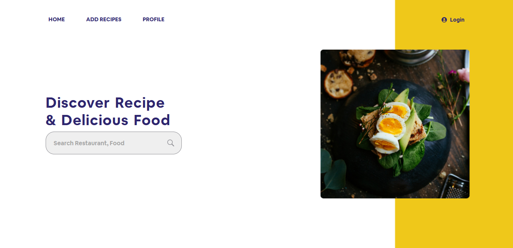
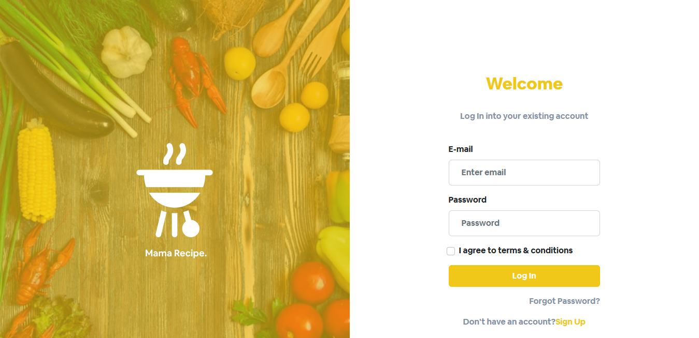
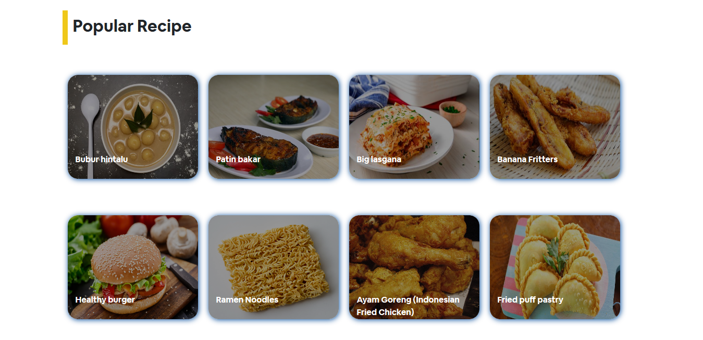

# Food Recipes 

## Contents

- [Description](#description)
- [Features](#features)
- [Requirements](#requirements-for-development)
- [Screenshoots](#screenshoots)
- [Demo Food Recipes Web](#demo-blanja-web)
- [Related Project](#related-project)

## Description

**Blanja Web** is a recipe sharing service that allowing visitors to upload and search through user-created recipes. 

## Features

- Search recipe
- Edit recipe
- Add recipe
- Save recipe
- Edit profile
- Reset Password
- and more...

## Requirements for Development

- [`Node Js`](https://nodejs.org/en/)
- [`npm`](https://www.npmjs.com/get-npm)
- [`ReactJs`](https://reactjs.org/)
- [`Recipes Backend`](https://github.com/Leha-leha/Recipe_API)

## Screenshoots

    
    
    

## Demo Food Recipes 

Let's try it.

## Related Project

RESTful API for this web application.

